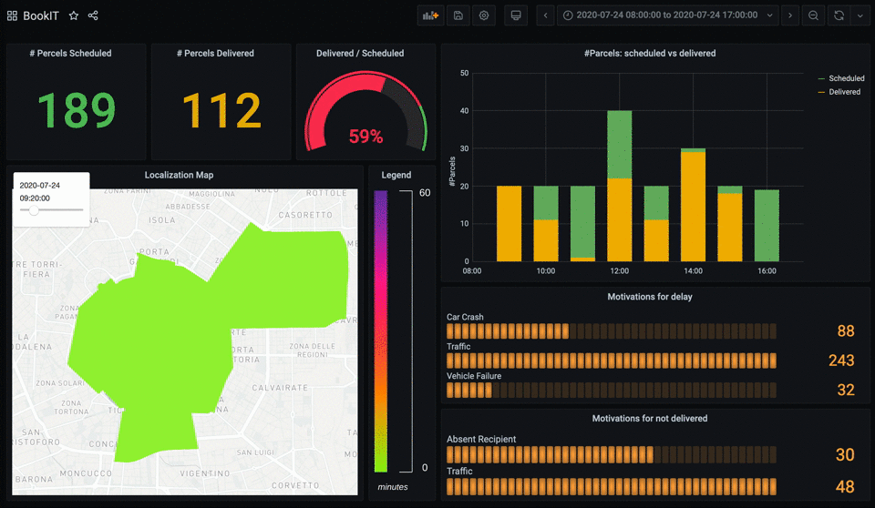

# BookIt Dashboard




## Description

This dashboard helps to monitor the parcel deliveries in the selected time range. It is developed in Grafana, while the data are stored in InfluxDB that is a Time Series database. 

This dashboard is composed of 7 graphs. Starting from the top-left position, they are:

- the number of scheduled parcels to be delivered during the selected time range;
- the number of delivered parcels during the selected time range;
- the ratio between the number of delivered and scheduled parcels during the selected time range;
- a histogram comparing, hour by hour, the number of scheduled and delivered parcels during the selected time range;
- a map showing, every 5 minutes, the average parcel delivery delay in every area of the city;
- a bar chart showing the principal motivations for the delay;
- a bar chart showing the principal motivations for failing to deliver a parcel;

## Data Modeling

The data are stored in an InfluxDB database. Every single sample must have four components:

- measurement: description and namespace for the sample.
- tagset: key/value string pairs usually used to identify the sample.
- fieldset: key/value pairs that are typed and usually contain the sample data.
- timestamp: date and time associated with the fields. 

The serialization format for samples is defined by the line protocol. 
An example point from the specification helps to explain the terminology:

```
measurement,tag1=tag1Value,tag2=tag2Value field1=field1Value,field2=field2Value timestamp
```

The timestamp has to be in UTC and unix format (nanosecond precision).

In our data, we have two measurements: *live_tracking* and *schedule*.

- *live_tracking* represents the data sent by each courier during the day. It has five tags and one field: 
	- the *courier* tag represents the courier id; 
	- the *event* tag represents what the courier is doing (in transit, arrived, parcel delivered, parcel not delivered);
	- the *status* tag indicates if the courier is in time or delay;
	- the *location* tag represents the name of the location where the courier is;
	- the *motivation* tag is the reason why the courier is in delay (optional). 
	- The *delay* field is the number of minutes of delay. 

- *schedule* represents the program of the day for every single courier. It has two tags and six fields: 
	- the *courier* tag represents the courier id;
	- the *location* tag represents the name of the location where the courier must deliver the parcel;
	- the *weight* field is the weight in cm of the parcel to be delivered;
	- the *volume* field is the volume in cm<sup>3</sup> of the parcel to be delivered;
	- the *width* field is the width in cm of the parcel to be delivered;
	- the *height* field is the height in cm of the parcel to be delivered;
	- the *length* field is the length in cm of the parcel to be delivered;
	- the *packages* field is the number of packages to be delivered; 

	**Note**: additional fields could be the exact delivery location.

## How to install

The entire dashboard is embedded in a docker file. All you have to do is clone or download this repository, open a terminal into its principal directory and type:

```
docker-compose up -d
``` 

##### Note: you must have installed docker before

Then open your browser and go [here](http://localhost:3000/). The username and password required by Grafana are both *admin*. Then, in the Dashboard menù, click the *manage* option and you will find the *bookit dashboard*. Clicking on it, you will see the structure of all the graphs but without any data.

The data must be loaded in InfluxDB. We provide a [set](https://github.com/emanuele-falzone/drviz/blob/master/data/data.txt) of synthetically generated data ready to be loaded into InfluxDB. To do that, open a terminal into the data directory and type:

```
sh populate.sh
```

Now, click the refresh button in the top-right position of the dashboard and you are done.
